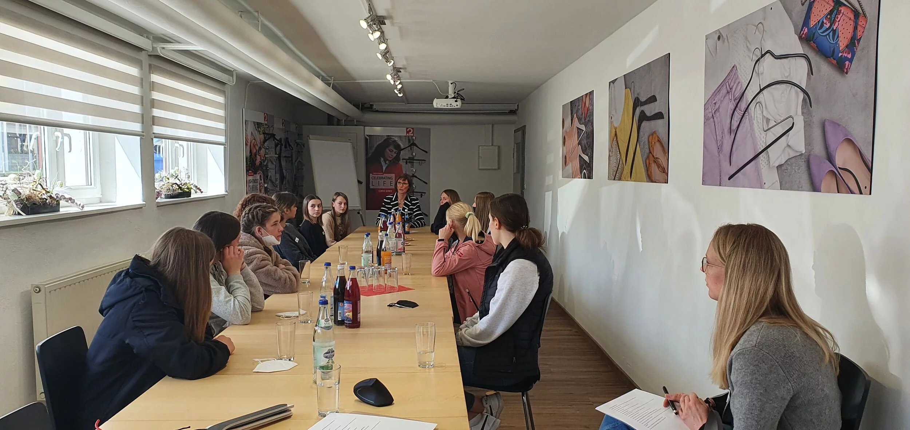

Michael Schenk, właścicielka i dyrektor zarządzająca MAWA GmbH, komentuje Międzynarodowy Dzień Kobiet oraz tematy równych praw i równych szans:

,,Międzynarodowy Dzień Kobiet obchodzony jest corocznie 8 marca, aby zwrócić uwagę na rolę kobiet w społeczeństwie. Pierwotnie stworzony w celu promowania równych praw, praw wyborczych dla kobiet i emancypacji kobiet, zmieniło się to nieco na przestrzeni lat. Na szczęście kobiety mogą teraz głosować prawie wszędzie, a nacisk kładzie się teraz bardziej na rolę kobiet w społeczeństwie i związane z tym kwestie, takie jak równe szanse, przemoc w stosunku do kobiet czy dyskryminacje kobiet.

Nawet dzisiaj jest wystarczająco dużo powodów do obchodzenia międzynarodowego dnia kobiet. To prawda, że w XX wieku równość poczyniła wielkie postępy, ale w wielu dziedzinach wciąż nie mówi się o równych prawach i szansach dla kobiet i mężczyzn. Na przykład  niektóre kraje nie zagwarantowały jeszcze równości płciowej,  a milion kobiet na całym świecie spotykają się z dyskryminacją w dostępie do edukacji lub opieki zdrowotnej.

Także w Europie kobiety są w niekorzystnej sytuacji – zwłaszcza na rynku pracy. Na przykład różnica w  wynagrodzeniach kobiet i mężczyzn nadal nie została zlikwidowana, co częściowo wynika z faktu, że kobiety częściej pozostają w domu, aby opiekować się dziećmi a przez to tracą czas pracy. Pandemia koronawirusa wzmocniła nawet taką ponowną tradycjonalizuję relacji płci. A kobiety wciąż są niedoreprezentowane na stanowiskach kierowniczych.

Ważne jest promowanie pogodzenia pracy i rodziny oraz oferowanie różnych modeli czasu pracy. Odsetek  kobiet mogą również stworzyć dynamiczny proces, dzięki któremu kobiety na stanowiskach kierowniczych podążają za innymi kobietami.

Zarówno dla kobiet, jak i mężczyzn jest to cenne, aby mieć żeńskie wzory do naśladowania. Kobiety na stanowiskach szefa prowadzą zespołem inaczej niż mężczyźni. Dlatego liczy się, aby kobiety zachęcać i wspierać na drodze do niezależności.”